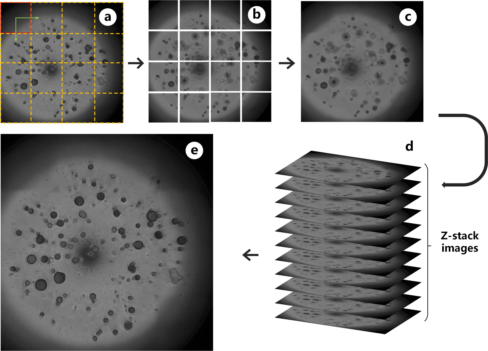
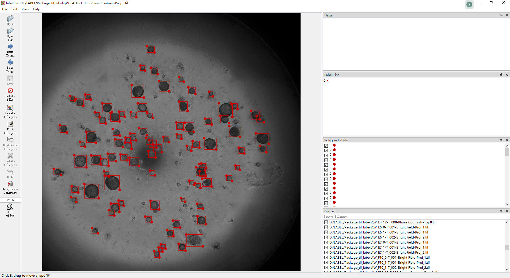
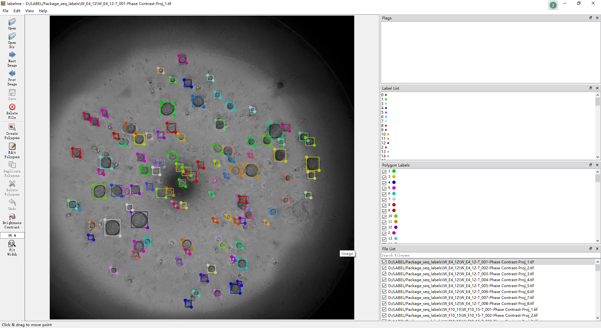
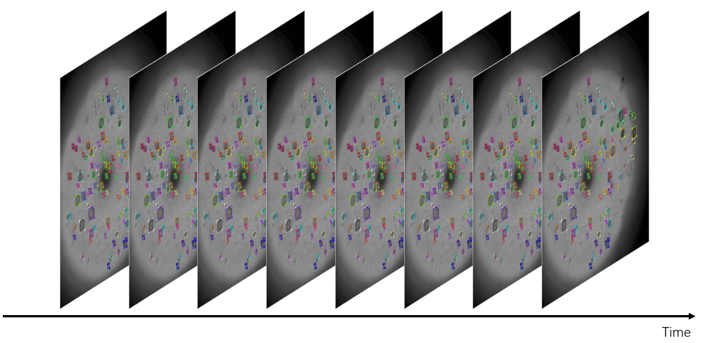

# High-throughput Organoid Tracking Dataset

This is a open high-throughput organoid dataset for tracking. All organoids derive from mouse liver which is cultured in 96-well plate. We take one image by BioTek Cytation5 cell imaging multi-mode reader for each well with the interval of 24 hours. 


Pipeline for capturing high-throughout organoid images. The dash frame in (**a**) are FOVs for scanning. Image patches in (**b**) are montages captured from 16 FOVs. (**c**) shows the stitched images from specific focus plane. 32 z-stack images in (**d**) are projected to generate (**e**).

## 2. File organization
``` bash
Organoid
├─Detection
│   ├─W_C10_0 # well name
│   │      Proj_1.tif # annotations
│   │      Proj_1.json # raw high-throughput organoid image
│   ├─W_C10_1
│   ├─W_C10_9
│   ├─......
│
└─Tracking 
    ├─W_E4_12 # well name
    │      Proj_1.json # annotations
    │      Proj_1.tif  # raw high-throughput organoid image
    │      Proj_2.json
    │      Proj_2.tif
    │      Proj_3.json
    │      Proj_3.tif
    │      ......
    │
    ├─W_F10_15
    ├─W_F10_3
    ├─ ......
```
## 3. Annotation parsing
All annotation are created by [labelme](https://github.com/wkentaro/labelme)  software (version 4.5.7). The json file for each image can be parsed by labelme directly and get the detailed information. In addition, we can also use the **json** package to read the annotation information.
- Detection labels


- Tracking labels
  
  

The json file contains two kinds of key information: First,the position of each qualified organoid; Second, the identity of each qualified organoid.
```json
{
  "version": "4.5.6",
  "flags": {},
  "shapes": [
    {
      "label": "0",
      "line_color": null,
      "fill_color": null,
      "points": [
        [
          746.0,
          402.0
        ],
        [
          801.0,
          455.0
        ]
      ],
      "shape_type": "rectangle",
      "flags": {}
    }
    // other shape
  ],
  "imagePath": "XXXXXXXXXX.tif",
  "imageData": "......",
  "imageHeight": 9122,
  "imageWidth": 9163
}
```


## 4. Download
We provide three ways to access this dataset.

1. All users can visit baidu netdisk to download this dataset (Link:https://pan.baidu.com/s/1a-3kzFPWKM6gwIresUE0BQ Password:vnwk).
2. All users can visit TeraBox to download this dataset (Link:https://dubox.com/s/18XxGfS8nnz2UXAvhtgVakg Password:e2y8).
3. All users can access the server (39.98.109.195:21) anonymously. Importantly, ensure `passive transmission mode` is set.

## 5. Acknowledgement
The data are captured by Accurate International Biotechnology (GZ) Co., Ltd, Nanfang Hospital and Southern Medical University. All annotation are created by team of Fujian Key Laboratory of Sensing and Computing for Smart City, Xiamen University. The data is available for free to researchers for non-commercial use.